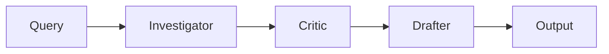

# Multi-Agent Architecture

## Overview

This framework implements a **3-agent pipeline** for legal document analysis, inspired by real-world litigation workflows.



---

## Agent Roles

### 1. Investigator Agent (`agents/investigator.py`)

**Purpose**: Exhaustive fact extraction without judgment.

**Key Principle**: *"Find everything, judge nothing"*

| Feature | Implementation |
|:---|:---|
| **Retrieval** | Hybrid (BM25 + Dense Vector) |
| **Weight** | 70% BM25, 30% Semantic |
| **Output** | Raw facts with citations |

**Usage:**
```python
from agents.investigator import InvestigatorAgent

agent = InvestigatorAgent(vectorstore_path="./legal_docs")
results = agent.search("Find all transfers of Survey No. 2306")
```

---

### 2. Critic Agent (`agents/critic.py`)

**Purpose**: Adversarial verification of Investigator's findings.

**Checks:**
- Citation validity (does `[Doc:Page:Line]` exist?)
- Factual consistency (do dates match across documents?)
- Contradiction detection (Revenue vs Registry discrepancies)

---

### 3. Drafter Agent (`agents/drafter.py`)

**Purpose**: Generate court-safe narrative from verified facts.

**Output Format:**
- Markdown report with embedded citations
- Every claim traceable to source
- No hallucinated content

---

## Why Multi-Agent?

| Single-Agent Problems | Multi-Agent Solution |
|:---|:---|
| Hallucinations pass unchecked | Critic catches errors |
| Citations not enforced | Drafter requires citations |
| Bias in fact selection | Investigator finds ALL facts |

---

## Author

**Swetang Gajjar** - Senior AI Engineer | Legal-Tech Specialist
